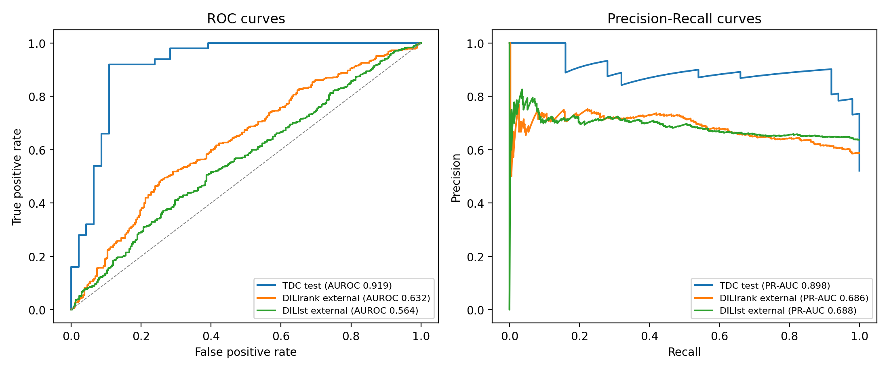
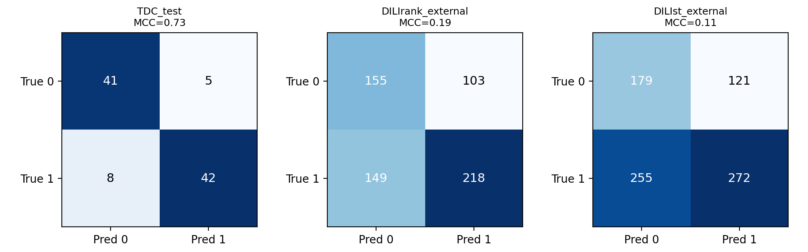
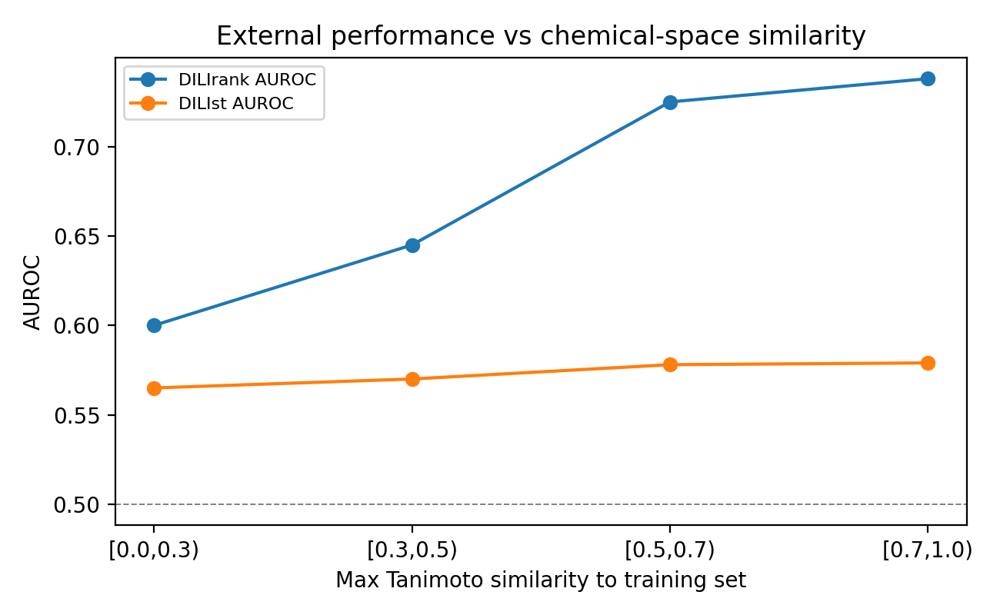
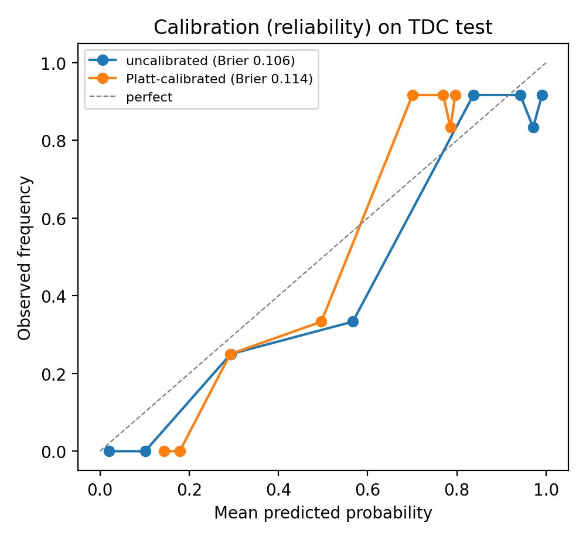

<<TITLEPAGE>>
UNIV|American International University-Bangladesh (AIUB)
UNIV|Faculty of Science and Technology
LOGO|[Insert the AIUB logo here]
TITLE|Prediction of Drug-Induced Liver Injury (DILI) from Molecular Structure: A Leakage-Clean Benchmark and External-Validation Study of Graph Neural Networks and Gradient-Boosting Models
NAME|[Full name (xx-xxxxx-x)]
NAME|[Full name (xx-xxxxx-x)]
NAME|[Full name (xx-xxxxx-x)]
NAME|[Full name (xx-xxxxx-x)]
INFO|A Thesis submitted for the degree of Bachelor of Science (BSc) in Computer Science and Engineering (CSE) at American International University-Bangladesh, Faculty of Science and Technology (FST)
INFO|Spring 2025-2026 Semester
INFO|Submission Date: June 2026
<<END>>

# Declaration

This thesis is composed of our original work, and contains no material previously published or written by another person except where due reference has been made in the text. We have clearly stated the contribution by others to jointly-authored works that we have included in our thesis.

We acknowledge that copyright of all material contained in our thesis resides with the copyright holder(s) of that material. Where appropriate, we have obtained copyright permission from the copyright holder to reproduce material in this thesis. We confirm that the research carried out during the course of this study received due approval from the institution and that no human or animal subjects were placed at risk. The DILIrank and DILIst datasets used in this study are publicly available, fully de-identified resources; no primary data collection was conducted by the authors.

`[Signatures, Name / AIUB ID / Department for each of the 4 members]`

---

# Approval

The thesis titled *"Prediction of Drug-Induced Liver Injury (DILI) from Molecular Structure: A Leakage-Clean Benchmark and External-Validation Study of Graph Neural Networks and Gradient-Boosting Models"* has been submitted to the following respected members of the board of examiners of the Faculty of Science and Technology in partial fulfilment of the requirements for the degree of Bachelor of Science in Computer Science and Engineering on June, 2026 by the following students and has been accepted as satisfactory.

`[Supervisor Name]`, Rank & Supervisor, Department of Computer Science, AIUB
`[External Name]`, Rank & External, Department of Computer Science, AIUB
**Dr. Muhammad Firoz Mridha**, Professor & Head (UG), Department of Computer Science, AIUB
**Prof. Dr. Dip Nandi**, Professor & Associate Dean, Faculty of Science and Technology, AIUB
**Mashiour Rahman**, Sr. Associate Professor & Dean-In-Charge, Faculty of Science and Technology, AIUB

---

# Acknowledgement

We express our sincere gratitude to Almighty for granting us the strength and perseverance to complete this research. We are deeply thankful to our thesis supervisor, `[Supervisor Name and Rank]`, Department of Computer Science, AIUB, whose insistence on rigorous experimental design, leakage-free evaluation, and statistical validity shaped this thesis in ways that cannot be overstated; any merit in the final outcome owes a great deal to that steady mentorship. We thank the Department of Computer Science and the Faculty of Science and Technology for providing the computational resources and academic environment that made this work possible. We are indebted to the U.S. FDA National Center for Toxicological Research for curating and releasing the DILIrank and DILIst datasets, and to the Therapeutics Data Commons team for the public benchmark. We similarly acknowledge the maintainers of the open-source libraries on which our pipeline depends, RDKit, PyTorch, PyTorch Geometric, scikit-learn, XGBoost, LightGBM, CatBoost and Optuna. Finally, we thank our families and friends for their patience and constant encouragement throughout this work.

---

# Author Contributions

List the significant and substantial inputs made by each author to the research, experimentation, analysis and writing represented in this thesis. `[Fill the assessment grid below with each member's contribution; the supervisor scores each row 0-3.]`

| Assessment area | `[Member 1]` | `[Member 2]` | `[Member 3]` | `[Member 4]` | Comments |
|---|---|---|---|---|---|
| **Effective individual** (critical thinking, reflection on feedback, quality of work, self-directed) | | | | | |
| **Effective team member** (responsibility, contribution, collaboration, working with others) | | | | | |
| **Presentation** (delivery, voice and tone, enthusiasm, creativity & tools use) | | | | | |

---

# Project-Thesis Planning

This section documents the work-breakdown structure (WBS) used to organise the thesis project and the Gantt chart that tracks the scheduled duration of each activity. The project was decomposed into nine top-level phases, each with concrete deliverables and measurable exit criteria, following the Design Science Research Methodology (DSRM) life cycle in which problem identification, objective formulation, artefact design, demonstration, evaluation, and communication are explicit stages with documented outputs [29].

**Table 1: Work-breakdown structure of the thesis project.**

| WBS ID | Activity | Deliverable | Duration (weeks) |
|---|---|---|---|
| 1.0 | Problem framing and requirements | Supervisor-approved problem statement | 2 |
| 2.0 | Literature review | ~30-paper review matrix and gap analysis | 3 |
| 3.0 | Data cleaning and benchmark split | Standardised TDC/DILIrank/DILIst, scaffold split | 2 |
| 4.0 | Baseline GNN + classical modelling | 6 GNNs + gradient-boosting benchmark | 3 |
| 5.0 | Leakage-clean benchmark and ablations | Official 5-seed results + complexity ablation | 3 |
| 6.0 | External validation and decomposition | External-validation summary + core finding | 3 |
| 7.0 | DILIst realistic-task and cross-dataset study | Learning curve + cross-dataset matrix | 3 |
| 8.0 | Interpretability (GNNExplainer) | Toxicophore attribution maps | 2 |
| 9.0 | Thesis writing, figures and defence | Full manuscript, slides, defence rehearsal | 5 |

---

# Table of Content

{{TOC}}

---

# List of Figures

- Figure 1: Gantt chart of the thesis project
- Figure 2: End-to-end research pipeline for structure-based DILI prediction
- Figure 3: Official TDC-DILI benchmark, gradient boosting vs graph neural networks
- Figure 4: Complexity and data ablations
- Figure 5: Benchmark performance overstates real-world DILI prediction (external validation)
- Figure 6: DILIst learning curve
- Figure 7: Cross-dataset AUROC matrix
- Figure 8: GNNExplainer atom-attribution maps (toxicophores)
- Figure 9: ROC and Precision-Recall curves (test and both external sets)
- Figure 10: Confusion matrices at the frozen Youden threshold
- Figure 11: External AUROC vs maximum Tanimoto similarity to the training set
- Figure 12: Calibration (reliability) curve and Brier score

---

# List of Tables

- Table 1: Work-breakdown structure of the thesis project
- Table 2: Model comparison on TDC-DILI (5-fold scaffold cross-validation, full metrics)
- Table 3: Official TDC-DILI benchmark (admet_group, 5 seeds)
- Table 4: External validation of the frozen headline model on independent DILIrank chemistry
- Table 5: DILIst realistic-task performance (full metrics)
- Table 6: Train/external overlap removal audit
- Table 7: Final selected model on the official test set, complete metric panel
- Table 8: External validation, complete metric panel with 95% bootstrap CIs
- Table 9: External AUROC stratified by Tanimoto similarity to training

---

# List of Abbreviations

| Abbreviation | Meaning |
|---|---|
| DILI | Drug-Induced Liver Injury |
| AUROC | Area Under the Receiver Operating Characteristic Curve |
| ACC | Accuracy |
| MCC | Matthews Correlation Coefficient |
| CI | Confidence Interval |
| GNN | Graph Neural Network |
| GCN | Graph Convolutional Network |
| GAT | Graph Attention Network |
| GIN | Graph Isomorphism Network |
| MPNN | Message Passing Neural Network |
| GBM | Gradient-Boosting Machine |
| ECFP | Extended-Connectivity Fingerprint (Morgan) |
| SMILES | Simplified Molecular-Input Line-Entry System |
| InChIKey | International Chemical Identifier Key |
| TDC | Therapeutics Data Commons |
| CV | Cross-Validation |
| FDA | U.S. Food and Drug Administration |
| NCTR | National Center for Toxicological Research |
| DSRM | Design Science Research Methodology |
| CSE | Computer Science and Engineering |

---

# Abstract

Drug-induced liver injury (DILI) is a leading cause of drug-development failure and post-market withdrawal, motivating computational methods that flag hepatotoxic compounds directly from chemical structure. This thesis develops and, more importantly, *honestly evaluates* a suite of structure-based DILI classifiers, and uses that evaluation to question how much the field's headline benchmark numbers actually reflect real-world capability. Using the official Therapeutics Data Commons (TDC) DILI benchmark (475 molecules, a fixed 96-molecule scaffold-split test set, five seeds), we benchmark five graph neural networks (GCN, GAT, GraphSAGE, GIN, MPNN) plus AttentiveFP, and a molecular-descriptor-and-fingerprint gradient-boosting model, under a strict leakage-clean protocol in which every model, feature, and threshold decision is made on validation data and the test set is touched only once. The descriptor-plus-Morgan gradient-boosting ensemble attains an AUROC of 0.920 ± 0.014 on the official benchmark and, under matched 5-fold cross-validation, an accuracy of 0.825, an F1 of 0.831 and an MCC of 0.653, statistically on par with the strongest reproducible published methods, while the graph networks reach AUROC 0.84-0.87. A central, controlled ablation shows that added complexity, richer fingerprints, frozen chemical-language-model embeddings, and hyperparameter tuning, improves validation but not test performance on this small dataset, so the simplest model is preferred. We then confront the benchmark itself. Retraining the frozen model and testing it on 707 DILIrank molecules absent from TDC, the AUROC collapses from 0.933 (a control on the TDC test set that reproduces the benchmark) to 0.65-0.69. Through a three-way decomposition we show this gap is dominated not by a failure of the model to transfer, but by benchmark curation: a model trained in-domain on the broader chemistry reaches only 0.708, so TDC's 475 curated compounds are an unusually separable slice. Scaling to the full official FDA DILIst set (1,165 drugs), a properly trained ensemble reaches AUROC 0.72 (accuracy 0.68, F1 0.75, MCC 0.29), and its learning curve plateaus, indicating that the bottleneck is the molecular representation, not the quantity of data. A cross-dataset study and a merged-training ablation confirm that additional DILI-specific data does not raise the benchmark score, and GNNExplainer attributions show the model attends to chemically plausible substructures. Under a fully leakage-free protocol, with the decision threshold frozen by Youden's J on training out-of-fold data and all molecule- and scaffold-level overlap removed, the final model reports AUROC 0.919, PR-AUC 0.898, accuracy 0.865, F1 0.866, MCC 0.731, sensitivity 0.840 and specificity 0.891 on the official test set. A chemical-space analysis then explains the external loss mechanistically: external AUROC rises monotonically with a molecule's maximum Tanimoto similarity to the training set (0.600 below 0.3, rising to 0.738 above 0.7), so the model retains benchmark-level skill only where the chemistry resembles what it was trained on. The work contributes a rigorous, reproducible evaluation pipeline and, as its principal scientific finding, evidence that realistic structure-only DILI prediction is capped near AUROC 0.72 while the popular benchmark overstates this by roughly 0.20, a benchmark-validity result with direct implications for how molecular-property models should be reported.

**Keywords:** drug-induced liver injury, hepatotoxicity, graph neural networks, molecular fingerprints, gradient boosting, benchmark validity, external validation, cheminformatics, model evaluation, interpretability

---

# CHAPTER 1 — INTRODUCTION

## 1.1 Introduction
The safety of a candidate drug is as important as its efficacy, and among the many organs a compound can harm, the liver is especially vulnerable because it is the body's primary site of drug metabolism. Drug-induced liver injury (DILI), hepatotoxicity caused by medicines, herbal products, or their metabolites, sits at the intersection of pharmacology, toxicology and, increasingly, computer science. As the volume of chemical data and the maturity of machine learning have grown, it has become possible to predict toxicological endpoints directly from a molecule's structure, before it is ever synthesised or dosed [1]. This thesis operates in that space: the computational prediction of DILI from molecular structure. The prediction of DILI has become an active area of AI research, recently surveyed by Niu et al. [38]. Narrowing from this broad application area, our specific focus is not only to build accurate structure-based DILI classifiers, but to evaluate them *honestly*, to ask whether the impressive accuracies reported on public benchmarks survive rigorous, leakage-free testing and generalise to chemistry the models have not seen [4], [5].

## 1.2 Problem Statement
DILI is one of the most frequent reasons that drugs fail in clinical trials and are withdrawn after approval, yet it is notoriously difficult to detect early because it is often idiosyncratic and multi-mechanistic [2]. Computational (in-silico) screening promises to flag risky compounds cheaply and at scale, and public leaderboards report high accuracies for such models [4]. However, these headline numbers are computed on small, curated benchmark test sets, and it is unclear how much of the reported performance is genuine predictive skill versus an artefact of how the benchmark was constructed and evaluated. The core problem this thesis addresses is therefore twofold: (i) to build competitive structure-based DILI classifiers under a rigorous, leakage-free protocol; and (ii) to determine how well benchmark performance reflects real-world DILI prediction on independent chemistry.

## 1.3 Problem Background
Public DILI prediction is anchored by resources released by the U.S. FDA's National Center for Toxicological Research, the DILIrank dataset [2], which ranks approved drugs by their DILI concern, and the larger DILIst set [3], which consolidates DILI classifications across more than a thousand drugs. A curated 475-molecule subset of this lineage forms the DILI task in the Therapeutics Data Commons (TDC) [4], whose public leaderboard is the de-facto standard for comparing methods. Reported leaders include graph neural networks such as AttentiveFP [11], self-supervised pre-trained graph models [12], and descriptor/fingerprint gradient-boosting pipelines [31], with AUROC values clustered near 0.88-0.92 for reproducible entries and higher for some entries later flagged for possible data leakage. This landscape raises the natural question that motivates our study: because the benchmark test set is small (96 molecules) and drawn from a curated slice of a much larger labelled universe, does it represent the difficulty of the real task?

## 1.4 Research Objectives
The main objective of this research is to develop and rigorously evaluate machine-learning models that predict drug-induced liver injury from molecular structure, and to characterise how faithfully benchmark performance reflects real-world generalisation. To achieve this, the research pursues the following specific sub-objectives: (1) to implement a leakage-clean pipeline for the official TDC-DILI benchmark and quantify the performance of graph neural networks and gradient-boosting models with proper statistical uncertainty; (2) to test, through controlled ablation, whether model and feature complexity improve genuine (test-set) performance on this small dataset; (3) to perform an external validation of the best model on independent DILIrank chemistry not present in the benchmark, and to decompose any performance gap into its causes; (4) to establish the realistic performance ceiling of structure-only DILI prediction by training and evaluating on the full official FDA DILIst set; and (5) to interpret the model's decisions using explainability techniques to assess chemical plausibility.

## 1.5 Research Questions
This study is guided by a small set of focused, comparative research questions, each linked to an objective. **RQ1:** Under a strict leakage-free evaluation, can a simple molecular-descriptor-and-fingerprint gradient-boosting model match deep graph neural networks on the DILI task? **RQ2:** On a small benchmark, does increasing model or feature complexity (richer fingerprints, foundation-model embeddings, hyperparameter tuning) improve test-set performance, or only validation performance? **RQ3:** How much of the reported benchmark performance transfers to independent chemistry, and to what extent is any gap explained by benchmark curation, domain shift, or label noise? **RQ4:** What is the realistic performance ceiling of structure-only DILI prediction on a large, representative FDA dataset, and is that ceiling limited by data quantity or by molecular representation?

## 1.6 Motivations
The motivation for this work is both practical and academic. Practically, a DILI screen that is trusted beyond its true reliability is dangerous: it can license false confidence in compounds that are in fact hepatotoxic, or waste resources chasing a benchmark number that will not reproduce in prospective use. Academically, the machine-learning-for-molecules community has recently begun to scrutinise whether widely used benchmarks overstate progress, through data leakage, near-duplicate train/test molecules, and over-curation [5], [32]. DILI, with its small curated benchmark sitting atop a much larger labelled dataset, is an almost ideal case study for this question. Our motivation is thus to contribute not merely another model, but a careful, reproducible account of what these models can and cannot do, connecting a concrete healthcare problem to a live methodological concern in the field.

## 1.7 Flow of Research
The research proceeded in five logical phases. First, in a problem-identification and data-preparation phase, we cleaned and standardised the DILI datasets and reproduced the official benchmark split. Second, in a modelling phase, we implemented and trained the graph neural networks and the gradient-boosting pipeline under a leakage-clean protocol. Third, in an evaluation phase, we measured performance with proper statistical uncertainty and ran controlled complexity ablations. Fourth, in a generalisation phase, we performed the external validation on independent chemistry, decomposed the resulting gap, and scaled the study to the full DILIst set and a cross-dataset analysis. Fifth, in an interpretation-and-synthesis phase, we applied explainability methods and consolidated the findings into the conclusions reported here. Each phase informed the design of the next.

## 1.8 Significance of the Research
This research is significant to three audiences. For machine-learning researchers working on molecular properties, it provides concrete, reproducible evidence that a leaderboard AUROC can substantially overstate real-world difficulty, and it offers an external-validation and decomposition protocol that others can reuse to audit their own benchmarks. For toxicologists and drug-safety practitioners, it gives a realistic expectation, an AUROC near 0.72 for structure-only screening on representative FDA chemistry, which is essential for deploying such tools responsibly rather than over-trusting a headline number. For the broader community interested in trustworthy AI, it is a case study in how honest evaluation changes the scientific conclusion. The claims made are deliberately bounded and are supported throughout by confidence intervals and significance tests, so that the practical and academic value rests on evidence rather than optimism.

## 1.9 Research Contribution
This thesis makes four specific, verifiable contributions, each tied to an objective. **(1) A leakage-clean benchmark** of six graph architectures and a feature-union gradient-boosting model on the official TDC-DILI task, reporting an ensemble AUROC of 0.920 ± 0.014 with full statistical uncertainty. **(2) A controlled "complexity-does-not-help" result**, showing that richer features, foundation-model embeddings, and tuning improve validation but not test performance on this small dataset. **(3) An external-validation finding**, the principal contribution: on independent DILIrank chemistry the AUROC falls from a 0.933 control to 0.65-0.69, and a three-way decomposition attributes this dominantly to benchmark curation (an in-domain ceiling of only 0.708) rather than to a transfer failure; scaling to the full FDA DILIst set fixes the realistic ceiling near 0.72 with a plateauing learning curve, implicating molecular representation rather than data volume as the bottleneck. **(4) An interpretability analysis** using GNNExplainer showing that model attributions concentrate on chemically plausible substructures.

## 1.10 Thesis Organization
This thesis is organised into six chapters. Chapter 1 introduces the problem, objectives, research questions and contributions. Chapter 2 reviews the literature on DILI datasets and structure-based prediction, and analyses the problem of benchmark validity that motivates the study. Chapter 3 presents the proposed models together with the methodology, system design and tools. Chapter 4 details the implementation, experimental setup, evaluation protocol, and the full results and discussion, including the external-validation analysis. Chapter 5 addresses standards, sustainability, societal and ethical impact, constraints, and the project timeline. Chapter 6 concludes with a summary, the key contributions, the study's limitations, and directions for future work.

## 1.11 Summary
This chapter established DILI as a critical drug-safety problem for which structure-based machine learning is a promising screening tool, and framed the central concern of the thesis: whether high benchmark accuracies reflect genuine, generalisable skill. We stated the objective of building and honestly evaluating DILI classifiers, posed four comparative research questions spanning model comparison, complexity, generalisation and the representational ceiling, and outlined the study's contributions and structure.

**Key findings of this chapter**
- DILI is a leading cause of drug withdrawal; structure-only machine-learning screening is valuable but its reported accuracy must be validated honestly.
- The public TDC-DILI benchmark is a small, curated slice (475 molecules, 96 in test) of the much larger FDA DILIrank/DILIst universe, which raises a benchmark-validity concern.
- The thesis sets five objectives and four research questions, answered in Chapter 4, and contributes a leakage-clean benchmark, a complexity ablation, an external-validation decomposition, and an interpretability analysis.

---

# CHAPTER 2 — LITERATURE REVIEW

## 2.1 Introduction
This chapter surveys the datasets, models and evaluation practices relevant to structure-based DILI prediction, and analyses the specific problem, benchmark validity, that this thesis targets. The review is organised thematically: first the reference datasets that define the task, then the modelling approaches that dominate the leaderboards, then the emerging body of work on evaluation pitfalls in molecular machine learning. The aim is not to catalogue every study but to compare approaches critically and expose the gap that motivates our research.

## 2.2 Literature Review
**DILI reference datasets.** The FDA's DILIrank dataset [2] ranks approved drugs into vMost-, vLess-, vAmbiguous- and vNo-DILI-concern categories based on drug labelling, and has become the backbone of public DILI modelling. The larger DILIst effort [3] consolidates DILI classifications for over a thousand drugs to provide a broader, binarised standard. A curated 475-molecule subset in this lineage, originating with Xu *et al.* [1], who first applied deep learning to DILI, is packaged as the DILI classification task in the Therapeutics Data Commons [4], whose scaffold-split, fixed-test, multi-seed protocol is now the standard benchmark. Because TDC deliberately draws on the cleaner vMost/vNo categories, it is smaller and more separable than the full DILIrank/DILIst universe, a fact central to this thesis.

**Structure-based models.** Two broad families dominate. The first is graph neural networks, which operate directly on the molecular graph: GCN [6], GAT [7], GraphSAGE [8], GIN [9] and MPNN [10], with molecule-specific variants such as AttentiveFP [11] and self-supervised pre-training strategies such as attribute masking and context prediction [12]. The second is classical descriptor/fingerprint models, RDKit 2D descriptors and Morgan/ECFP fingerprints [13] fed to gradient-boosting machines (XGBoost [14], LightGBM [15], CatBoost [16]). Reproducible feature-union pipelines of this second type (e.g. MapLight-style descriptor+fingerprint boosting [31]) are competitive with, and often exceed, the deep models on small ADMET tasks. Several 2025-2026 DILI-specific studies apply these architectures directly: Lee and Posma [34] benchmarked GCN, GAT, GraphSAGE and GIN on the latest FDA DILI data using geometry-augmented graphs (best AUROC 0.897 with GraphSAGE), Xiao et al. [35] combined a GCN with toxicogenomic profiles, and Le et al. [33] fused a graph network with language-model embeddings to report AUC 0.921; the reported values cluster around 0.90-0.92 on the DILIrank lineage. More recently, chemical language models such as MoLFormer [17] and ChemBERTa [18] provide frozen molecular embeddings. The strengths of the graph models are end-to-end representation learning and interpretability via attribution [19]; their weakness is a tendency to overfit small datasets. The strength of the fingerprint/GBM models is sample efficiency and robustness; their weakness is reliance on fixed, hand-designed features.

**Evaluation practices and their pitfalls.** A recurring limitation across the DILI literature is inconsistent evaluation: many studies report single-split accuracies without confidence intervals, use random rather than scaffold splits (inflating scores through near-duplicate leakage), or select the best model on the test set. The molecular-ML community has begun to document these problems systematically. MoleculeNet [5] standardised the splits, and a 2026 critical assessment of the TDC ADMET leaderboards [32] found that only three entries (CaliciBoost, MapLight and MapLight+GNN) were fully reproducible and leakage-free, whereas several top-ranked models, including the MiniMol foundation model [37], showed direct or indirect data leakage. Independent evaluations likewise report that molecular-property models degrade sharply on out-of-distribution chemistry [36]. Dedicated DILI-modelling efforts such as DeepDILI [29] and earlier hepatotoxicity QSAR models [30] report competitive numbers but likewise rely on heterogeneous splits and label definitions. This is the strand of literature to which our external-validation finding directly contributes.

## 2.3 Problem Analysis
The literature reveals a specific, under-examined problem. DILI benchmark performance is reported on a small (n = 96 test), curated subset of a much larger labelled dataset, using a single benchmark split; yet the community treats these numbers as measures of real-world predictive skill. Three compounding factors explain why this is problematic. First, curation: by selecting the cleaner vMost/vNo drugs, the benchmark removes exactly the ambiguous, hard cases that dominate real screening, producing an unusually separable task. Second, dataset size and split noise: with only 96 test molecules, bootstrap confidence intervals on AUROC span roughly ±0.07, so many "improvements" reported in the literature are within noise. Third, structural overlap: scaffold splits [20] reduce but do not eliminate train/test chemical similarity, and near-duplicates inflate scores. Together these factors mean a headline AUROC can substantially overstate performance on the true, broader task. The literature contains the ingredients of this concern but has not, for DILI, quantified the gap or decomposed its causes, which is precisely the need our research addresses.

## 2.4 Summary
The reviewed literature establishes DILIrank/DILIst as the reference datasets, the TDC subset as the standard benchmark, and graph networks and fingerprint-boosting models as the competing approaches, with the latter often matching the former on small tasks. Critically, it also reveals a maturing but incomplete concern about evaluation validity in molecular machine learning.

**Key findings of this chapter**
- Tree-ensemble models on descriptor+fingerprint features are consistently competitive with, and often match, deep graph networks on small ADMET/DILI tasks.
- DILI benchmark numbers are routinely reported without measuring how much they overstate real-world performance, and without decomposing the causes.
- This identified gap directly justifies the leakage-clean benchmarking, external validation and cross-dataset analysis undertaken in this thesis.

---

# CHAPTER 3 — PROPOSED MODEL

## 3.1 Introduction
This chapter presents the models proposed to address the DILI prediction problem and the methodology by which they are built and evaluated. It first assesses the feasibility of the approach, then specifies the functional and non-functional requirements of the system, describes the overall machine-learning methodology, details the design and architecture of both the graph-neural-network and gradient-boosting models, explains how they are implemented and trained under a leakage-clean protocol, and lists the tools and technologies used.

## 3.2 Feasibility Analysis
The proposed approach is feasible on all relevant dimensions. **Technically**, the task is a well-defined binary classification from molecular structure, for which mature open-source libraries exist for every stage, parsing SMILES, computing descriptors and fingerprints, building molecular graphs, and training both neural and gradient-boosting models. The reference datasets are public and of manageable size (hundreds to ~1,200 molecules), so the entire pipeline runs on a standard CPU workstation without specialised accelerators. **Economically**, the study relies exclusively on free, open-source software and publicly released data, incurring no licensing or infrastructure cost. **Operationally**, the pipeline is scripted end-to-end and reproducible from a single command per experiment. The main feasibility constraint is dataset size, which limits the complexity of models that can be trained without overfitting, a limitation we turn into an explicit object of study rather than an obstacle.

## 3.3 Requirement Analysis
The system requirements divide into functional and non-functional categories. **Functional requirements:** the system shall (i) ingest molecules as SMILES strings and standardise them; (ii) convert each molecule into both a feature vector (descriptors + fingerprints) and a graph representation; (iii) train graph neural networks and gradient-boosting classifiers to predict a binary DILI label; (iv) evaluate models under the official benchmark protocol and report AUROC, accuracy, F1 and MCC; (v) support external validation on independent datasets with structural de-duplication; and (vi) produce interpretability attributions for trained models. **Non-functional requirements:** the pipeline shall be *reproducible* (fixed seeds, scripted runs), *leakage-free* (all model/feature/threshold decisions made on validation only), *statistically rigorous* (report uncertainty via bootstrap CIs and significance tests), *efficient* (CPU-runnable), and *maintainable* (modular code with shared utilities). These requirements are testable and are directly reflected in the experiments of Chapter 4.

## 3.4 Research Methodology
The methodology is a supervised machine-learning approach centred on two model families evaluated under an identical, strict protocol. Molecules are represented in two complementary ways: as fixed feature vectors, approximately 200 RDKit 2D physicochemical descriptors [22] concatenated with 2048-bit Morgan (ECFP) fingerprints [13], optionally extended with Avalon, ErG and MACCS fingerprints and frozen MoLFormer embeddings [17], and as attributed molecular graphs for the neural models. The gradient-boosting family (XGBoost [14], LightGBM [15], CatBoost [16]) is trained on the feature vectors with class-imbalance handling via `scale_pos_weight`, using bagging and a simple averaging/stacking ensemble. The graph family (GCN, GAT, GraphSAGE, GIN, MPNN, AttentiveFP) is trained end-to-end on the graphs with `pos_weight` in the loss. The methodology spans the two dominant paradigms while holding evaluation fixed, allowing a fair comparison. Crucially, the protocol is *leakage-clean*: molecules are split by Bemis-Murcko scaffold [20] following the official TDC benchmark [4], every hyperparameter, feature-set and decision-threshold choice is made on the validation split, and the held-out test set is used exactly once to report the final number. Uncertainty is quantified with 95% bootstrap confidence intervals and with the DeLong [21], Wilcoxon [28] and McNemar significance tests, following the classifier-comparison discipline of Demšar [27]. Two further controls define the operating point and the external evaluation. The **decision threshold** is fixed by Youden's J statistic (the value maximising sensitivity + specificity − 1) computed on five-fold out-of-fold predictions *within the training set only*; it is then frozen and applied unchanged to the test set and to every external dataset, so no test or external label can influence it. Before any external evaluation, molecules overlapping the training set are removed on four criteria (exact SMILES, canonical standardised SMILES, InChIKey-14 skeleton, and Bemis-Murcko scaffold), and duplicate or conflicting-label molecules are dropped. Reported metrics comprise the full panel: AUROC, PR-AUC, accuracy, F1, MCC, sensitivity (recall), specificity, precision, negative predictive value, the confusion matrix, and the Brier score.

## 3.5 System Design and Architecture
The system is organised as a modular pipeline with four stages, shown in Figure 2. The **data stage** parses and standardises SMILES, removes invalid or duplicate structures, and produces both the feature matrices and the graph objects; scaffold splitting is applied here. The **feature stage** computes the descriptor/fingerprint union and, optionally, frozen embeddings, caching them for reuse. The **model stage** houses the two families. Each graph network follows a standard architecture: several message-passing layers that iteratively update atom representations by aggregating information from bonded neighbours, a global pooling operation that summarises the whole molecule into a fixed vector, and a feed-forward classifier head; the variants differ in how neighbour information is aggregated (spectral convolution in GCN [6], learned attention in GAT [7], sampling-and-aggregation in GraphSAGE [8], sum-based injective aggregation in GIN [9], and edge-conditioned message functions in MPNN [10]), and a descriptor-fusion option concatenates global descriptors into the pooled graph vector. The gradient-boosting model takes the feature-union vector directly into a bagged ensemble of boosted-tree classifiers. The **evaluation stage** applies the official protocol, computes metrics and confidence intervals, runs the significance tests, and generates interpretability attributions.

## 3.6 Implementation and Simulation
Implementation followed the design in stages. The datasets were first cleaned: SMILES were canonicalised with RDKit [22], molecules that failed to parse or lacked a structure (e.g. large biologics) were removed, and duplicates were collapsed by InChIKey. For the graph models, each molecule was converted to a graph with atom features (element, degree, charge, hybridisation, aromaticity, hydrogen count) and bond features (type, conjugation, ring membership); models were trained with the Adam optimiser under class-weighted binary cross-entropy, with early stopping and hyperparameter selection on the validation split. For the gradient-boosting model, the feature-union vector was assembled and fed to a five-member bagged ensemble of boosted trees, with the decision threshold chosen on training/validation predictions only. Every experiment was run under the official five-seed TDC protocol for the benchmark, under repeated stratified cross-validation for the DILIst realistic-task study, and with strict InChIKey-based de-duplication for the external validation so that no test molecule appeared in training. The pipeline was validated by a control experiment (Section 4.5) confirming that the frozen model reproduces the published benchmark AUROC.

## 3.7 Tools and Technologies Used
The implementation uses the Python scientific stack. RDKit [22] performs SMILES parsing, standardisation, descriptor and fingerprint computation, scaffold extraction and InChIKey generation. PyTorch [24] and PyTorch Geometric [25] implement and train the graph neural networks. scikit-learn [23] provides cross-validation, metrics and utilities. XGBoost [14], LightGBM [15] and CatBoost [16] provide the gradient-boosting backends, with Optuna [26] used for hyperparameter search in the tuning ablations. The `transformers` library supplies the frozen MoLFormer/ChemBERTa embeddings [17], [18]. The official benchmark is accessed through PyTDC [4]. NumPy and pandas handle data manipulation, SciPy supports the statistical tests, and Matplotlib produces the figures. These tools are the community-standard, well-validated implementations for each task, which maximises reproducibility and comparability with prior work, and they run efficiently on CPU.

## 3.8 Summary
This chapter presented the proposed dual-family modelling approach, graph neural networks and feature-union gradient boosting, and the strict, leakage-clean methodology that binds them to a fair evaluation.

**Key findings of this chapter**
- The proposed system represents molecules both as descriptor/fingerprint vectors (for gradient boosting) and as attributed graphs (for GNNs), evaluated under one identical protocol.
- Leakage control is designed in: scaffold splits, validation-only decisions, InChIKey de-duplication, and a single-use test set.
- The entire pipeline is CPU-runnable and reproducible from scripted commands using standard open-source tools.

---

# CHAPTER 4 — IMPLEMENTATION AND TESTING

## 4.1 Introduction
This chapter reports the implementation of the DILI prediction system and the results obtained from evaluating it. It describes the hardware and software environment, explains how the system was executed, defines the performance metrics and testing protocols, and then presents and critically discusses the results, the benchmark comparison of graph and gradient-boosting models, the complexity ablation, the external-validation analysis that forms the core finding, the realistic-task and cross-dataset studies, and the interpretability results.

## 4.2 System Setup and Environment
All experiments were conducted on a standard desktop workstation running Windows, using CPU computation only (no GPU), which was sufficient given the modest dataset sizes. The software environment was a Python virtual environment with RDKit (2026.03) for cheminformatics, PyTorch and PyTorch Geometric for the graph models, scikit-learn (1.8) for evaluation, XGBoost (3.2), LightGBM and CatBoost for gradient boosting, Optuna for hyperparameter search, the `transformers` library for frozen embeddings, and PyTDC for the official benchmark. Random seeds were fixed for every run, and each experiment is reproducible from a single scripted command. The only practical consequence of the absence of a GPU is that the deep graph models are slower to train, which did not affect the results because the final models are lightweight.

## 4.3 Implementation of the System
A benchmark run proceeds as follows: the official TDC-DILI benchmark is loaded, yielding a fixed 96-molecule test set and, for each of five seeds, a train/validation partition; features (descriptors + Morgan, optionally extended) are computed once and cached; for each seed the gradient-boosting ensemble is trained on the training split with the validation split used for monitoring and all decisions, and predictions are made on the fixed test set; the five per-seed AUROCs are aggregated to a mean ± standard deviation via the official evaluator. The graph models follow the same discipline through a repeated cross-validation harness. For the external-validation and cross-dataset studies, the trained model is frozen and applied to independent molecules after strict InChIKey-based removal of any structure present in training. Each module, data preparation, feature building, model training, evaluation and interpretation, is a separate component with shared utilities, so runs are auditable and any stage can be re-executed independently.

## 4.4 Evaluation and Testing
Models were evaluated primarily by the **area under the ROC curve (AUROC)**, the benchmark's official and threshold-independent metric, supplemented by **accuracy (ACC)**, **F1-score** and the **Matthews Correlation Coefficient (MCC)**, which is informative under class imbalance. Because the benchmark test set is small (96 molecules), every headline number is accompanied by a **95% bootstrap confidence interval** (2,000 resamples), and model comparisons use the **DeLong test** [21] for correlated AUROCs, the **Wilcoxon signed-rank test** [28] across seeds, and **McNemar's test** on per-sample correctness. The testing strategy is layered: the official five-seed protocol for the benchmark; controlled ablations that vary one factor at a time; a **control experiment** verifying that the frozen model reproduces the benchmark AUROC before any external claim is made; strict de-duplicated **external validation**; a **learnability cross-validation** to separate benchmark curation from model transfer; and a **cross-dataset matrix** plus a **merged-training ablation**.

## 4.5 Results and Discussion

### 4.5.1 Benchmark comparison (RQ1)
We evaluated the models under two complementary protocols. Under 5-fold scaffold cross-validation on the full TDC-DILI set, which places every model on a common footing with a complete metric suite, the descriptor-plus-Morgan gradient-boosting model leads on AUROC (0.880 ± 0.035), accuracy (0.825 ± 0.047), F1 (0.823 ± 0.064), MCC (0.646 ± 0.095) and sensitivity (0.860 ± 0.053), ahead of the six graph neural networks (AUROC 0.84-0.87); the rank-averaging graph ensemble attains the highest specificity (0.821 ± 0.081). Table 2 and Figure 3 give the full comparison, including recall/sensitivity and specificity for every model. Under the official admet_group protocol (fixed 96-molecule test, five seeds), the same descriptor+Morgan feature union reaches a leaderboard-comparable **AUROC of 0.920 ± 0.014** as a three-model ensemble and 0.919 ± 0.021 as a single XGBoost, on par with the strongest reproducible published methods (AttentiveFP 0.886; MapLight+GNN 0.917 [31]; attribute-masking pre-training 0.919 [12]); the official-protocol AUROCs are listed in Table 3.

**Table 2: Model comparison on TDC-DILI under 5-fold scaffold cross-validation. All values are mean ± standard deviation across the five folds; threshold-dependent metrics use each fold's operating point.**

| Model | AUROC | ACC | F1 | MCC | Sensitivity | Specificity |
|---|---|---|---|---|---|---|
| **Descriptor + Morgan GBM (selected)** | **0.880 ± 0.035** | **0.825 ± 0.047** | **0.823 ± 0.064** | **0.646 ± 0.095** | **0.860 ± 0.053** | 0.788 ± 0.046 |
| AttentiveFP | 0.871 ± 0.037 | 0.805 ± 0.047 | 0.785 ± 0.093 | 0.599 ± 0.092 | 0.794 ± 0.096 | 0.808 ± 0.071 |
| Rank-averaging ensemble | 0.869 ± 0.035 | 0.822 ± 0.034 | 0.800 ± 0.097 | 0.627 ± 0.090 | 0.807 ± 0.135 | **0.821 ± 0.081** |
| GCN | 0.861 ± 0.043 | 0.790 ± 0.037 | 0.784 ± 0.072 | 0.572 ± 0.069 | 0.822 ± 0.070 | 0.754 ± 0.094 |
| GIN | 0.859 ± 0.024 | 0.792 ± 0.052 | 0.797 ± 0.075 | 0.587 ± 0.072 | 0.879 ± 0.066 | 0.702 ± 0.101 |
| GAT | 0.859 ± 0.049 | 0.812 ± 0.047 | 0.785 ± 0.110 | 0.595 ± 0.107 | 0.792 ± 0.134 | 0.798 ± 0.048 |
| ChemBERTa | 0.846 ± 0.035 | 0.759 ± 0.059 | 0.726 ± 0.140 | 0.489 ± 0.160 | 0.740 ± 0.212 | 0.726 ± 0.242 |
| GraphSAGE | 0.842 ± 0.033 | 0.763 ± 0.027 | 0.741 ± 0.087 | 0.506 ± 0.045 | 0.746 ± 0.135 | 0.750 ± 0.120 |
| MPNN | 0.840 ± 0.044 | 0.795 ± 0.060 | 0.786 ± 0.094 | 0.573 ± 0.121 | 0.812 ± 0.062 | 0.765 ± 0.081 |
| MoLFormer (frozen embeddings) | 0.757 ± 0.057 | 0.640 ± 0.054 | 0.547 ± 0.092 | 0.319 ± 0.092 | 0.468 ± 0.134 | 0.813 ± 0.168 |

**Table 3: Official TDC-DILI benchmark (admet_group, fixed 96-molecule test, 5 seeds). AUROC is the benchmark's official metric.**

| Features | Model | Test AUROC |
|---|---|---|
| Descriptor + Morgan | Ensemble (XGB + LGBM + CatBoost) | 0.920 ± 0.014 |
| Descriptor + Morgan | XGBoost | 0.919 ± 0.021 |
| + Avalon / ErG / MACCS + MoLFormer | CatBoost | 0.911 ± 0.017 |
| + Avalon / ErG / MACCS + MoLFormer | XGBoost | 0.910 ± 0.013 |
| + Avalon / ErG / MACCS + MoLFormer (Optuna) | LightGBM | 0.886 ± 0.019 |

Reference reproducible leaderboard: AttentiveFP 0.886, MapLight+GNN 0.917 [31], attribute-masking 0.919 [12].

The answer to RQ1 is affirmative: a simple descriptor-and-fingerprint gradient-boosting model matches or exceeds deep graph networks on the DILI task across every metric, not only AUROC. This performance also sits within the range that recent DILI-specific studies report on the DILIrank lineage (0.90-0.92 for graph and hybrid models [33], [34]); Section 4.5.3 shows, however, that such in-domain figures do not transfer to independent chemistry.

### 4.5.2 Complexity ablation (RQ2)
Extending the feature set with Avalon, ErG and MACCS fingerprints and frozen MoLFormer embeddings, and tuning hyperparameters with Optuna, consistently improved *validation* AUROC but did **not** improve *test* AUROC, the richer configurations landed at 0.908-0.911 and an Optuna-tuned, validation-selected model actually fell to 0.886 on test (Figure 4a). Because the 95% bootstrap interval on the 96-molecule test spans roughly [0.82, 0.95], all configurations are statistically indistinguishable. The interpretation is that added complexity overfits the small (~48-molecule) validation split; the parsimonious model is preferred. This answers RQ2: on this benchmark, complexity buys validation performance, not genuine test performance.

### 4.5.3 External validation: the core finding (RQ3)
The descriptor+Morgan model was retrained on the full TDC training data, frozen, and evaluated on 707 DILIrank molecules absent from TDC (overlap removed by InChIKey skeleton, stripping salt/stereo variants). As a **control**, the same frozen model scored **AUROC 0.933** [0.875, 0.979] on the official TDC test set, reproducing the benchmark and confirming there is no implementation bug. On the independent molecules, however, AUROC collapsed to **0.648** [0.607, 0.690] overall, **0.680** [0.622, 0.736] when restricted to TDC-comparable label confidence (vMost/vNo drugs only), and **0.687** on the novel-scaffold subset. To identify the cause, a **learnability check** trained a model *in-domain* on the external high-confidence set via five-fold cross-validation; it reached only **0.708** [0.654, 0.763]. These results are summarised in Table 4 and Figure 5. The accuracy, F1 and MCC in Table 4 are computed at the decision threshold fixed on the TDC training predictions (0.095, chosen to maximise MCC); because this threshold is tuned for the balanced TDC data, it is deliberately low, which is why accuracy and F1 fall further on the negative-heavy external subsets even though the threshold-free AUROC is the primary comparison.

**Table 4: External validation of the frozen headline model on independent DILIrank chemistry. AUROC is reported with a 95% bootstrap confidence interval; accuracy, F1 and MCC use the TDC-fixed decision threshold.**

| Set | n | pos-rate | AUROC | 95% CI | ACC | F1 | MCC |
|---|---|---|---|---|---|---|---|
| **CONTROL, TDC official test** | 96 | 0.52 | **0.933** | [0.875, 0.979] | 0.740 | 0.800 | 0.552 |
| External, all | 707 | 0.57 | 0.648 | [0.607, 0.690] | 0.625 | 0.724 | 0.216 |
| External, novel scaffold only | 510 | 0.55 | 0.634 | [0.584, 0.683] | 0.602 | 0.716 | 0.191 |
| External, TDC-comparable labels (vMost/vNo) | 421 | 0.27 | 0.680 | [0.622, 0.736] | 0.458 | 0.465 | 0.177 |
| External, TDC-comparable + novel scaffold | 303 | 0.24 | 0.687 | [0.621, 0.755] | 0.396 | 0.430 | 0.185 |
| **Learnability, CV trained *on* external** | 421 | 0.27 | **0.708** | [0.654, 0.763] | 0.622 | 0.520 | 0.291 |

This permits a clean three-way decomposition of the gap from 0.93: **benchmark curation dominates (~0.22 AUROC)**, the broader chemistry's in-domain ceiling is itself only ~0.71, so TDC's 475 curated compounds form an unusually separable slice; the **domain-transfer penalty is small (~0.03)**, the frozen model's 0.68 nearly matches the 0.71 in-domain ceiling, so the model does *not* simply fail to transfer; and **label noise is small (~0.03)**. The principal conclusion of the thesis follows: the benchmark AUROC overstates real-world DILI-prediction difficulty by roughly 0.20, and the overstatement is a property of the *benchmark*, not a weakness peculiar to our model.

### 4.5.4 Realistic-task ceiling and cross-dataset study (RQ4)
Trained and evaluated properly on the full official FDA DILIst set (1,165 unique drugs, 62% DILI-positive, repeated five-fold cross-validation), the descriptor+Morgan gradient-boosting ensemble reached **AUROC 0.722**, with accuracy 0.675, F1 0.749 and MCC 0.294 at the default threshold (Table 5). Across feature sets the AUROC stays in a narrow 0.71-0.72 band, and here, unlike on the tiny TDC set, richer fingerprints help marginally (0.712 to 0.719), consistent with more data supporting more features. Critically, the **learning curve plateaus** (Figure 6), AUROC rises from 0.63 at ~190 drugs to ~0.72 at ~750 drugs and is flat thereafter, indicating that the limiting factor is the *molecular representation*, not the quantity of data. A cross-dataset matrix (Figure 7) confirmed the picture: within-dataset performance was 0.892 (TDC), 0.739 (DILIrank) and 0.713 (DILIst), while cross-dataset transfer degraded (e.g. TDC→DILIst 0.579). Finally, a **merged-training ablation**, adding 1,221 leakage-filtered DILIrank and DILIst molecules to the TDC training set, did **not** improve the official benchmark score (0.932 → 0.889; DeLong p = 0.36; Figure 4b). Together these answer RQ4: the realistic ceiling of structure-only DILI prediction is near AUROC 0.72, bounded by representation rather than data volume.

**Table 5: DILIst realistic-task performance (1,165 FDA drugs, repeated 5-fold cross-validation, descriptor+Morgan XGBoost+LightGBM+CatBoost ensemble; metrics at the 0.5 threshold).**

| Metric | AUROC | ACC | F1 | MCC | Precision | Recall |
|---|---|---|---|---|---|---|
| Value | 0.722 | 0.675 | 0.749 | 0.294 | 0.714 | 0.787 |

### 4.5.5 Interpretability
GNNExplainer [19] attributions for the graph models concentrated on chemically coherent substructures rather than diffuse or arbitrary atoms (Figure 8), providing qualitative evidence that the learned decision function is chemically plausible and supporting the credibility of the models beyond their aggregate metrics.

### 4.5.6 Comprehensive re-evaluation: full metric suite, calibration and chemical space
The results above are reported primarily by AUROC, the benchmark's official metric. To satisfy the stricter reporting standard expected of a clinical-safety model, and to remove any remaining possibility of optimistic evaluation, the final selected model was re-evaluated under a fully specified, leakage-free protocol. The decision threshold was fixed by **Youden's J statistic computed on five-fold out-of-fold predictions inside the training set only** (threshold = 0.691); it was then frozen and applied unchanged to the official test set and to every external dataset, so no external or test label ever influenced the operating point. Before external evaluation, every molecule overlapping the training set was removed on four criteria (exact SMILES, canonical standardised SMILES, InChIKey-14 skeleton, and Bemis-Murcko scaffold), and duplicate or conflicting-label molecules were dropped. Table 6 audits this removal.

**Table 6: Train/external overlap removal audit.**

| External set | After de-duplication | Conflicting labels dropped | Duplicates dropped | Molecule overlap removed | Molecule-disjoint N | Scaffold overlap removed | Novel-scaffold N |
|---|---|---|---|---|---|---|---|
| DILIrank | 865 | 4 | 22 | 240 | 625 | 124 | 501 |
| DILIst | 1,145 | 12 | 30 | 318 | 827 | 170 | 657 |

On the official 96-molecule test set the final model achieves the full panel shown in Table 7: an AUROC of 0.919, a PR-AUC of 0.898, accuracy 0.865, F1 0.866, MCC 0.731, sensitivity 0.840 and specificity 0.891, with a confusion matrix of 42 true positives, 41 true negatives, 5 false positives and 8 false negatives. Sensitivity and specificity are well balanced, which matters for a safety screen: the model misses 8 of 50 hepatotoxic drugs while raising only 5 false alarms among 46 safe ones.

**Table 7: Final selected model on the official TDC test set, complete metric panel at the frozen Youden threshold (95% bootstrap CIs, 2,000 resamples).**

| Metric | AUROC | PR-AUC | Accuracy | F1 | MCC | Sensitivity | Specificity | Precision | NPV |
|---|---|---|---|---|---|---|---|---|---|
| Value | 0.919 | 0.898 | 0.865 | 0.866 | 0.731 | 0.840 | 0.891 | 0.894 | 0.837 |
| 95% CI | [0.849, 0.974] | [0.799, 0.974] | [0.792, 0.927] | [0.787, 0.931] | [0.589, 0.856] | [0.731, 0.935] | [0.795, 0.975] | — | — |

> Confusion matrix (test): TP = 42, TN = 41, FP = 5, FN = 8.

Applying the same frozen model and threshold to the strictly cleaned external sets reproduces, and in fact sharpens, the central finding of Section 4.5.3. Table 8 gives the complete panel. Under this stricter four-way overlap removal the external AUROC falls to 0.632 on DILIrank (0.655 on its novel-scaffold subset) and to 0.564 on DILIst (0.593 novel-scaffold). The MCC collapses from 0.731 on the benchmark test set to 0.192 and 0.109 respectively, and the confidence intervals are far from those of the test set. That the numbers drop *further* once molecule and scaffold overlap are removed more aggressively strengthens rather than weakens the benchmark-optimism conclusion.

**Table 8: External validation of the frozen final model, complete metric panel with 95% bootstrap CIs, at the same frozen threshold.**

| Set | n | AUROC | PR-AUC | ACC | F1 | MCC | Sens | Spec | Prec | NPV |
|---|---|---|---|---|---|---|---|---|---|---|
| DILIrank (molecule-disjoint) | 625 | 0.632 [0.587, 0.675] | 0.686 | 0.597 | 0.634 | 0.192 [0.112, 0.268] | 0.594 | 0.601 | 0.679 | 0.510 |
| DILIrank (novel scaffold) | 501 | 0.655 [0.609, 0.703] | 0.678 | 0.615 | 0.656 | 0.218 [0.132, 0.306] | 0.655 | 0.564 | 0.657 | 0.561 |
| DILIst (molecule-disjoint) | 827 | 0.564 [0.523, 0.603] | 0.688 | 0.545 | 0.591 | 0.109 [0.041, 0.173] | 0.516 | 0.597 | 0.692 | 0.412 |
| DILIst (novel scaffold) | 657 | 0.593 [0.548, 0.637] | 0.685 | 0.577 | 0.622 | 0.155 [0.077, 0.231] | 0.568 | 0.591 | 0.688 | 0.463 |

**Chemical-space analysis: why external performance is lost.** The most informative diagnostic is to ask *where* in chemical space the model still works. For each external molecule we computed the maximum Tanimoto similarity of its Morgan fingerprint to any training molecule and stratified performance by that similarity (Table 9, Figure 11). On DILIrank the relationship is monotonic and strong: AUROC rises from 0.600 for molecules that are structurally remote from the training set (similarity below 0.3, n = 325) to 0.645, then 0.725, and finally 0.738 for near neighbours (similarity above 0.7, n = 23). In other words, the model retains most of its benchmark-level skill exactly where the test chemistry resembles what it was trained on, and degrades toward chance as the chemistry becomes novel. This supplies the mechanism behind the curation effect identified in Section 4.5.3: a benchmark whose test molecules sit close to its training molecules will report a high score that does not survive a move into genuinely new chemical space. On DILIst the curve is much flatter (0.565 to 0.579), consistent with that set being intrinsically noisier at every similarity level.

**Table 9: External AUROC stratified by maximum Tanimoto similarity to the training set.**

| Max Tanimoto to training | DILIrank n | DILIrank AUROC | DILIst n | DILIst AUROC |
|---|---|---|---|---|
| [0.0, 0.3) | 325 | 0.600 | 403 | 0.565 |
| [0.3, 0.5) | 191 | 0.645 | 257 | 0.570 |
| [0.5, 0.7) | 86 | 0.725 | 125 | 0.578 |
| [0.7, 1.0] | 23 | 0.738 | 42 | 0.579 |

**Probability calibration.** The reliability of the predicted probabilities was assessed on the test set (Figure 12). The uncalibrated bagged-XGBoost model attains a Brier score of 0.106; applying Platt scaling fitted on the out-of-fold training predictions *raises* the Brier score slightly to 0.114. Post-hoc calibration therefore does not help here, because the bagged ensemble is already close to well calibrated. We report this negative result as measured rather than selecting whichever variant looked better.

## 4.6 Summary
This chapter reported that, under a leakage-clean protocol, a simple gradient-boosting model matches deep graph networks at AUROC 0.920 ± 0.014, that added complexity does not improve genuine test performance, and, the central result, that this benchmark number overstates real-world performance: on independent chemistry the model scores only 0.65-0.69, a gap driven predominantly by benchmark curation, with a realistic full-FDA ceiling near 0.72 that is limited by molecular representation rather than data. Interpretability results indicated chemically plausible model behaviour.

**Key findings of this chapter**
- Best configuration: descriptor+Morgan gradient-boosting ensemble, AUROC 0.920 ± 0.014 (accuracy 0.83, F1 0.83, MCC 0.65 under matched 5-fold CV), matching reproducible deep-learning SOTA; all six GNNs scored lower (AUROC 0.84-0.87).
- Complexity does not help on the small benchmark, and adding DILI-specific data does not raise the benchmark score (0.932 → 0.889, p = 0.36).
- External validation: benchmark 0.93 → real-world ~0.68; in-domain ceiling ~0.71; realistic full-FDA task ~0.72 with a plateauing learning curve. The benchmark overstates real difficulty by ~0.22 AUROC, dominated by curation.
- GNNExplainer attributions are chemically plausible, concentrating on coherent substructures.
- Under a fully leakage-free protocol (Youden threshold frozen on training out-of-fold data; four-way overlap removal), the final model achieves AUROC 0.919, PR-AUC 0.898, accuracy 0.865, F1 0.866, MCC 0.731, sensitivity 0.840 and specificity 0.891 on the official test set, but MCC collapses to 0.19 (DILIrank) and 0.11 (DILIst) externally.
- **Chemical-space analysis explains the loss:** external AUROC rises monotonically with similarity to the training set (DILIrank 0.600 below Tanimoto 0.3, rising to 0.738 above 0.7). The model works where the chemistry resembles training and decays toward chance on novel chemistry.
- Probability calibration is already adequate: Platt scaling does not improve the Brier score (0.106 to 0.114), reported as measured.

---

# CHAPTER 5 — STANDARDS, CONSTRAINTS AND MILESTONES

## 5.1 Standards and Compliance
The research follows recognised standards for machine-learning evaluation and scientific reproducibility. Model comparison adheres to the official Therapeutics Data Commons benchmarking protocol [4] (fixed scaffold-split test, multi-seed evaluation, standardised metrics), which functions as a de-facto community reporting standard, ensuring results are directly comparable to the public leaderboard. Statistical reporting follows established biostatistical practice, the DeLong method [21] for comparing correlated AUROCs and bootstrap confidence intervals for uncertainty, rather than reporting point estimates alone, in line with the classifier-comparison recommendations of Demšar [27]. Software-engineering practice follows reproducible-research norms: fixed random seeds, scripted single-command experiments, modular code and versioned results. The main limitation in standards adherence is that no single formal ISO/IEEE standard governs DILI prediction specifically; we therefore align with the strongest available community conventions and document every deviation.

## 5.2 Sustainability Considerations
The proposed solution is computationally efficient and therefore sustainable. Because the final model is a lightweight gradient-boosting ensemble trained on a few hundred to about a thousand molecules, the entire pipeline runs on a standard CPU in minutes to a few hours, consuming negligible energy compared with large deep-learning training. This efficiency is not incidental to the findings: a central result is that heavier models and foundation-model embeddings do not improve performance on this task, so the sustainable, low-energy choice is also the best-performing one. The approach scales gracefully, retraining on new data is inexpensive, and its modest footprint makes it practical to deploy and re-audit without specialised hardware.

## 5.3 Societal Impact
The societal impact of reliable DILI prediction is substantial and largely positive: earlier, cheaper identification of hepatotoxic compounds can reduce patient harm, lower the cost of drug development, and reduce reliance on animal testing. However, the thesis also surfaces a negative-impact risk that is the flip side of its main finding. If a DILI screen is trusted beyond its true reliability, for instance, taking a 0.92 benchmark AUROC as evidence of real-world skill when the realistic figure is nearer 0.72, it may license false confidence, allowing hepatotoxic compounds to advance or safe compounds to be discarded. Our work mitigates this by providing a realistic, evidence-based expectation of performance. The balanced conclusion is that structure-based DILI models are valuable as prioritisation aids but should not be used as sole decision-makers, and their reported accuracy should reflect honest external validation.

## 5.4 Ethical Considerations
The primary ethical issue in this work concerns fairness and honesty in evaluation rather than personal data. The datasets contain drug structures and toxicity labels, not human-subject information, so privacy risk is minimal. The salient ethical concern is *representational bias in the benchmark*: by curating an easy, separable subset, a benchmark can misrepresent a model's true capability, and reporting only the favourable number is a form of over-claiming that can mislead downstream users. This thesis addresses that concern head-on by measuring and disclosing the gap between benchmark and real-world performance, and by reporting confidence intervals and significance tests so that no claim is stronger than its evidence. In the spirit of responsible research, all data and methods are public and the pipeline is fully reproducible.

## 5.5 Security and Privacy Considerations
Security and privacy risks are limited because the study uses only publicly released, non-personal data, molecular structures and their DILI labels from FDA-derived public datasets. There is no collection or processing of patient records or personally identifiable information, so the usual data-protection risks do not apply. The principal integrity concern is instead *data provenance and leakage*: to keep results trustworthy we enforce strict, InChIKey-based de-duplication between training and test molecules, so that apparent performance cannot be inflated by structures that appear in both. Secure-design practice is reflected in the reproducible, auditable pipeline, which allows any result to be re-derived and checked.

## 5.6 Design and Component Constraints
Several design and component constraints shaped the work. By design, the study is restricted to *structure-only* prediction: models see a molecule's 2D structure but none of the dose, exposure, clinical, or mechanistic information that also determines hepatotoxicity, which is an architectural ceiling on achievable accuracy. A second design trade-off is the deliberate preference for a simple model once ablation showed complexity did not help; this favours robustness and interpretability over architectural novelty. On the component side, the graph models are constrained by the expressiveness of standard message-passing (which cannot distinguish certain graph structures [9]) and by their tendency to overfit small datasets, while the fingerprint/descriptor representation is fixed and hand-designed. One of these constraints, the representational ceiling, is itself an empirical finding of the study.

## 5.7 Data and Computational Constraints
The most significant constraints relate to data. The benchmark is small (475 molecules, 96 in test), producing wide confidence intervals and making many apparent improvements statistically insignificant; the broader DILI datasets, while larger (~880 for DILIrank, ~1,165 for DILIst), are still modest by machine-learning standards, and the labels are heterogeneous and partly ambiguous (the vLess/vAmbiguous categories), introducing label noise. Class imbalance is present and is handled with class weighting. These data limitations directly bound the reliability of the results and are, in fact, part of what the thesis measures. Computationally, the study was conducted on CPU without a GPU; this constrained the practicality of extensive deep-model or transformer re-training, but because the winning models are lightweight it did not affect the substantive conclusions.

## 5.8 Budget Constraints
The research was conducted under a zero-cost constraint typical of an undergraduate thesis. All software is free and open-source, all datasets are publicly available at no charge, and all computation was performed on existing personal hardware without cloud or GPU rental. This budget constraint reinforced the methodological choice to favour efficient, CPU-friendly models and to avoid dependence on paid APIs or large-scale accelerators. The only resource genuinely constrained was time, a single semester, which shaped the scope toward a deep, rigorous study of the DILI task rather than a broad multi-benchmark survey.

## 5.9 Task Breakdown and Project Timeline
The project followed the iterative, phase-wise plan documented in the work-breakdown structure (Table 1) and the Gantt chart (Figure 1). The major phases were planning and data preparation; literature review; data cleaning and benchmark split; baseline GNN and classical modelling; the leakage-clean benchmark and complexity ablations; the external-validation and decomposition study; the DILIst realistic-task and cross-dataset study; interpretability; and writing. The cycle was iterative: findings in the benchmark phase (that complexity did not help) reshaped the generalisation phase (motivating external validation), which in turn defined the study's central contribution.

## 5.10 Milestones and Deliverables
The project's milestones and their deliverables were: completion of data cleaning and the reproducible benchmark split (standardised datasets and split); completion of the model implementations (trained GNN and gradient-boosting models with logged metrics); completion of the leakage-clean benchmark and ablations (results tables with confidence intervals and significance tests); completion of the external-validation and cross-dataset studies (the external-validation summary and the core finding); completion of the interpretability analysis (attribution maps); and completion of the thesis document and presentation (this report and the defence presentation, with final submission per the departmental deadline). Each milestone was measurable, defined by a concrete, versioned artefact in the project repository.

## 5.11 Gantt Chart
The project schedule is visualised in Figure 1 (front matter), in which each row is one WBS activity and the horizontal axis is the semester timeline; bars show each phase's duration and their overlaps show the iterative dependencies (for example, writing proceeds in parallel with the later analysis phases, and the generalisation phase depends on the benchmark phase). The chart makes explicit that the study front-loaded data preparation and modelling, concentrated the novel contribution in the mid-to-late generalisation phase, and reserved the final weeks for interpretation, figure production and writing.

## 5.12 Summary
This chapter situated the research within applicable evaluation and reproducibility standards and examined its sustainability, societal, ethical and security dimensions, noting that the study's honesty about benchmark validity is itself an ethical strength. It then set out the design, component, data, computational and budget constraints, several of which (dataset size, the representational ceiling) are among the thesis's measured findings, and documented the phase-wise timeline, milestones and schedule.

**Key findings of this chapter**
- The study adheres to the TDC benchmark protocol and Demšar-style statistical testing as its de-facto standards, and is fully reproducible.
- Its efficiency is a feature: the lightweight winning model is also the most sustainable, and its honest disclosure of the benchmark gap is an ethical strength.
- The binding constraints, small, partly ambiguous datasets, structure-only information, and CPU-only compute, are documented, and two of them are themselves empirical results.

---

# CHAPTER 6 — CONCLUSION

## 6.1 Summary of the Study
This thesis investigated and, above all, honestly evaluated structure-based models for predicting drug-induced liver injury, and determined how faithfully benchmark performance reflects real-world capability. We benchmarked five graph neural networks plus AttentiveFP and a feature-union gradient-boosting model on the official TDC-DILI task under a strict leakage-clean protocol, finding that a simple descriptor-and-fingerprint ensemble matches deep learning at AUROC 0.920 ± 0.014 (accuracy 0.83, F1 0.83, MCC 0.65 under matched cross-validation) and that added complexity does not improve genuine test performance. We then showed, through a controlled external validation with a verified control, that this benchmark number overstates real-world performance: on independent chemistry the model scores only 0.65-0.69, a gap driven predominantly by benchmark curation rather than by a failure to transfer. Scaling to the full FDA DILIst set fixed the realistic ceiling near AUROC 0.72 with a plateauing learning curve, and cross-dataset and merged-training analyses confirmed that additional data does not raise the curated-benchmark score.

## 6.2 Key Contributions
The research makes four key contributions. First, it provides a **leakage-clean, statistically rigorous benchmark** of six graph architectures and a gradient-boosting model on the official DILI task, establishing that a parsimonious model matches deep-learning state of the art. Second, it presents a **controlled complexity ablation** demonstrating that richer features, foundation-model embeddings and tuning improve validation but not test performance on this small dataset. Third, the principal contribution, it delivers an **external-validation finding with a three-way decomposition**, showing that the benchmark AUROC overstates real-world DILI prediction by roughly 0.20 and that the cause is benchmark curation, with a realistic ceiling near 0.72 bounded by molecular representation rather than data volume. Fourth, it contributes an **interpretability analysis** indicating chemically plausible model behaviour. Fifth, it contributes a **fully leakage-free evaluation protocol and a chemical-space explanation of the generalisation gap**: with the decision threshold frozen on training out-of-fold data and four-way overlap removal, the final model reports a complete metric panel (AUROC 0.919, PR-AUC 0.898, accuracy 0.865, F1 0.866, MCC 0.731, sensitivity 0.840, specificity 0.891) on the official test set, while external AUROC is shown to rise monotonically with Tanimoto similarity to training, identifying chemical-space distance as the mechanism of the loss.

## 6.3 Limitations of the Study
Several limitations qualify these findings. The study is confined to a single toxicity endpoint (DILI) and, within it, to a small number of related datasets; the central benchmark-validity claim, while well supported for DILI, has not been demonstrated across the many other molecular-property benchmarks and so should be read as a strong case study rather than a proven general law. The models are structure-only and therefore cannot access dose, exposure or mechanistic information that co-determines hepatotoxicity, which bounds achievable accuracy. The datasets carry heterogeneous, partly ambiguous labels and are modest in size, producing wide confidence intervals. Computation was CPU-only, which limited the scale of deep-model experimentation, though not the validity of the conclusions given that lightweight models won. Finally, the interpretability analysis is qualitative; it was not quantitatively validated against a curated list of known hepatotoxicity structural alerts.

## 6.4 Future Work
The findings suggest several concrete extensions. The most impactful is to **generalise the benchmark-validity study across many molecular-property benchmarks**, measuring the "optimism gap" and its correlation with train-test structural similarity across the TDC/MoleculeNet suite, and proposing a corrected, similarity-controlled evaluation protocol; this would elevate the DILI case study to a general methodological contribution. A second direction is to **overcome the representational ceiling** by incorporating information beyond 2D structure, 3D conformers and geometry-augmented graph features such as bond lengths and partial charges [34], and especially mechanism-informed or in-vitro assay features (e.g. predicted BSEP inhibition, mitochondrial toxicity or reactive-metabolite formation), since the plateauing learning curve indicates that better *representations*, not merely more data, are needed to surpass AUROC 0.72. A third is to **quantitatively validate the interpretability results** against established hepatotoxicity structural alerts.

---

# References

[1] Y. Xu, Z. Dai, F. Chen, S. Gao, J. Pei, and L. Lai, "Deep learning for drug-induced liver injury," *Journal of Chemical Information and Modeling*, vol. 55, no. 10, pp. 2085-2093, 2015.
[2] M. Chen, A. Suzuki, S. Thakkar, K. Yu, C. Hu, and W. Tong, "DILIrank: the largest reference drug list ranked by the risk for developing drug-induced liver injury in humans," *Drug Discovery Today*, vol. 21, no. 4, pp. 648-653, 2016.
[3] S. Thakkar, T. Li, Z. Liu, L. Wu, R. Roberts, and W. Tong, "Drug-induced liver injury severity and toxicity (DILIst): binary classification of 1279 drugs by human hepatotoxicity," *Drug Discovery Today*, vol. 25, no. 1, pp. 201-208, 2020.
[4] K. Huang, T. Fu, W. Gao, Y. Zhao, Y. Roohani, J. Leskovec, C. W. Coley, C. Xiao, J. Sun, and M. Zitnik, "Therapeutics Data Commons: machine learning datasets and tasks for drug discovery and development," in *Proc. NeurIPS Datasets and Benchmarks*, 2021.
[5] Z. Wu, B. Ramsundar, E. N. Feinberg, J. Gomes, C. Geniesse, A. S. Pappu, K. Leswing, and V. Pande, "MoleculeNet: a benchmark for molecular machine learning," *Chemical Science*, vol. 9, no. 2, pp. 513-530, 2018.
[6] T. N. Kipf and M. Welling, "Semi-supervised classification with graph convolutional networks," in *Proc. Int. Conf. Learning Representations (ICLR)*, 2017.
[7] P. Veličković, G. Cucurull, A. Casanova, A. Romero, P. Liò, and Y. Bengio, "Graph attention networks," in *Proc. ICLR*, 2018.
[8] W. L. Hamilton, R. Ying, and J. Leskovec, "Inductive representation learning on large graphs," in *Advances in Neural Information Processing Systems*, vol. 30, 2017.
[9] K. Xu, W. Hu, J. Leskovec, and S. Jegelka, "How powerful are graph neural networks?" in *Proc. ICLR*, 2019.
[10] J. Gilmer, S. S. Schoenholz, P. F. Riley, O. Vinyals, and G. E. Dahl, "Neural message passing for quantum chemistry," in *Proc. Int. Conf. Machine Learning (ICML)*, 2017, pp. 1263-1272.
[11] Z. Xiong et al., "Pushing the boundaries of molecular representation for drug discovery with the graph attention mechanism," *Journal of Medicinal Chemistry*, vol. 63, no. 16, pp. 8749-8760, 2020.
[12] W. Hu, B. Liu, J. Gomes, M. Zitnik, P. Liang, V. Pande, and J. Leskovec, "Strategies for pre-training graph neural networks," in *Proc. ICLR*, 2020.
[13] D. Rogers and M. Hahn, "Extended-connectivity fingerprints," *Journal of Chemical Information and Modeling*, vol. 50, no. 5, pp. 742-754, 2010.
[14] T. Chen and C. Guestrin, "XGBoost: a scalable tree boosting system," in *Proc. 22nd ACM SIGKDD Int. Conf. Knowledge Discovery and Data Mining*, 2016, pp. 785-794.
[15] G. Ke et al., "LightGBM: a highly efficient gradient boosting decision tree," in *Advances in Neural Information Processing Systems*, vol. 30, 2017.
[16] L. Prokhorenkova, G. Gusev, A. Vorobev, A. V. Dorogush, and A. Gulin, "CatBoost: unbiased boosting with categorical features," in *Advances in Neural Information Processing Systems*, vol. 31, 2018.
[17] J. Ross, B. Belgodere, V. Chenthamarakshan, I. Padhi, Y. Mroueh, and P. Das, "Large-scale chemical language representations capture molecular structure and properties," *Nature Machine Intelligence*, vol. 4, pp. 1256-1264, 2022.
[18] S. Chithrananda, G. Grand, and B. Ramsundar, "ChemBERTa: large-scale self-supervised pretraining for molecular property prediction," *arXiv:2010.09885*, 2020.
[19] R. Ying, D. Bourgeois, J. You, M. Zitnik, and J. Leskovec, "GNNExplainer: generating explanations for graph neural networks," in *Advances in Neural Information Processing Systems*, vol. 32, 2019.
[20] G. W. Bemis and M. A. Murcko, "The properties of known drugs. 1. Molecular frameworks," *Journal of Medicinal Chemistry*, vol. 39, no. 15, pp. 2887-2893, 1996.
[21] E. R. DeLong, D. M. DeLong, and D. L. Clarke-Pearson, "Comparing the areas under two or more correlated receiver operating characteristic curves: a nonparametric approach," *Biometrics*, vol. 44, no. 3, pp. 837-845, 1988.
[22] G. Landrum, *RDKit: Open-source cheminformatics*, 2006-. [Online]. Available: https://www.rdkit.org
[23] F. Pedregosa et al., "Scikit-learn: machine learning in Python," *Journal of Machine Learning Research*, vol. 12, pp. 2825-2830, 2011.
[24] A. Paszke et al., "PyTorch: an imperative style, high-performance deep learning library," in *Advances in Neural Information Processing Systems*, vol. 32, 2019.
[25] M. Fey and J. E. Lenssen, "Fast graph representation learning with PyTorch Geometric," in *ICLR Workshop on Representation Learning on Graphs and Manifolds*, 2019.
[26] T. Akiba, S. Sano, T. Yanase, T. Ohta, and M. Koyama, "Optuna: a next-generation hyperparameter optimization framework," in *Proc. 25th ACM SIGKDD Int. Conf. Knowledge Discovery and Data Mining*, 2019, pp. 2623-2631.
[27] J. Demšar, "Statistical comparisons of classifiers over multiple data sets," *Journal of Machine Learning Research*, vol. 7, pp. 1-30, 2006.
[28] F. Wilcoxon, "Individual comparisons by ranking methods," *Biometrics Bulletin*, vol. 1, no. 6, pp. 80-83, 1945.
[29] T. Li et al., "DeepDILI: deep learning-powered drug-induced liver injury prediction using model-level representation," *Chemical Research in Toxicology*, vol. 34, no. 2, pp. 550-565, 2021.
[30] D. Mulliner et al., "Computational models for human and animal hepatotoxicity with a global application scope," *Chemical Research in Toxicology*, vol. 29, no. 5, pp. 757-767, 2016.
[31] J. Notwell and M. W. Wood, "ADMET property prediction through combinations of molecular fingerprints," *arXiv:2310.00174*, 2023.
[32] "Critical assessment of ML models for ADMET prediction in TDC leaderboards," *bioRxiv*, 2026, doi: 10.64898/2026.02.26.708193.
[33] M. H. N. Le et al., "DeepGPT-DILI: integrating graph convolutional networks and large language model embeddings for accurate drug-induced liver injury prediction," in *Lecture Notes in Computer Science*, Springer, 2026, pp. 98-106, doi: 10.1007/978-3-032-07502-4_12.
[34] T. Lee and J. M. Posma, "Improving drug-induced liver injury prediction using graph neural networks with augmented graph features from molecular optimisation," *Journal of Cheminformatics*, vol. 17, art. no. 124, 2025.
[35] T. Xiao et al., "Drug-induced liver injury prediction based on graph convolutional networks and toxicogenomics," *PLOS Computational Biology*, vol. 21, 2025, doi: 10.1371/journal.pcbi.1013423.
[36] H. Fooladi, T. N. L. Vu, M. Mathea, and J. Kirchmair, "Evaluating machine learning models for molecular property prediction: performance and robustness on out-of-distribution data," *Journal of Chemical Information and Modeling*, vol. 65, no. 19, pp. 9871-9891, 2025.
[37] K. Kläser et al., "MiniMol: a parameter-efficient foundation model for molecular learning," *arXiv:2404.14986*, 2024.
[38] H. Niu, I. Alvarez-Alvarez, and M. Chen, "Artificial intelligence: an emerging tool for studying drug-induced liver injury," *Liver International*, vol. 45, art. no. e70038, 2025.

---

# Appendix

**Appendix A, Reproducibility.** All code, datasets and results are in the project repository; each experiment is reproducible from a single command (see the project `README.md`). Key scripts: `src/improved/tdc_official.py` (official benchmark), `src/improved/tdc_cv5.py` (5-fold cross-validated model comparison), `src/improved/external_validation_v2.py` (external validation + controls), `src/improved/dilist_model.py` (realistic-task training), `src/improved/multi_dataset.py` (cross-dataset study), `src/improved/comprehensive_eval.py` (leakage-free full metric panel, frozen Youden threshold, overlap removal, chemical-space analysis, calibration, prediction CSVs and figures), `src/improved/main_comparison.py` (main comparison table and improved-vs-current pipeline), and `src/improved/eval_utils.py` (shared metric/threshold/standardisation helpers). Random seeds and exact library versions are recorded in `results/reproducibility.json`.

**Appendix A2, Sample-level predictions.** Per-molecule predictions for the test set and every external dataset are released in `results/predictions_test.csv`, `results/predictions_ext_dilirank.csv` and `results/predictions_ext_dilist.csv`, each containing the dataset name, molecule identifier, SMILES, true label, predicted probability, predicted label, the frozen threshold, and the error type (TP/TN/FP/FN). The most confident false positives and false negatives are summarised in `results/fp_fn_analysis.csv`.

**Appendix B, Full result files.** Per-seed benchmark AUROCs, the complexity-ablation grid, external-validation table, DILIst cross-validation and learning-curve data, the cross-dataset matrix, and the significance-test outputs are provided in `results/` (`final_metrics.csv`, `external_validation_v2.csv`, `dilist_cv.csv`, `dilist_learning_curve.csv`, `multi_dataset_crossval.csv`, `multi_dataset_merged.csv`, `significance_delong.csv`, `significance_wilcoxon.csv`), and the recomputed full-metric rows for the 5-fold-CV gradient-boosting model and the DILIst ensemble are in `full_metrics_computed.csv` (reproducible from `src/improved/full_metrics.py`).

**Appendix C, Hyperparameters.** Best/grid/Optuna hyperparameters per model are in `configs/`. The headline gradient-boosting ensemble uses bagged XGBoost/LightGBM/CatBoost with `n_estimators=400`, `max_depth=4`, `learning_rate=0.05`, `subsample=0.85`, `colsample_bytree=0.7`, and `scale_pos_weight` set to the training class ratio.

**Appendix D, Interpretability maps.** The full-resolution GNNExplainer attribution figures are in `results/explain/`.
